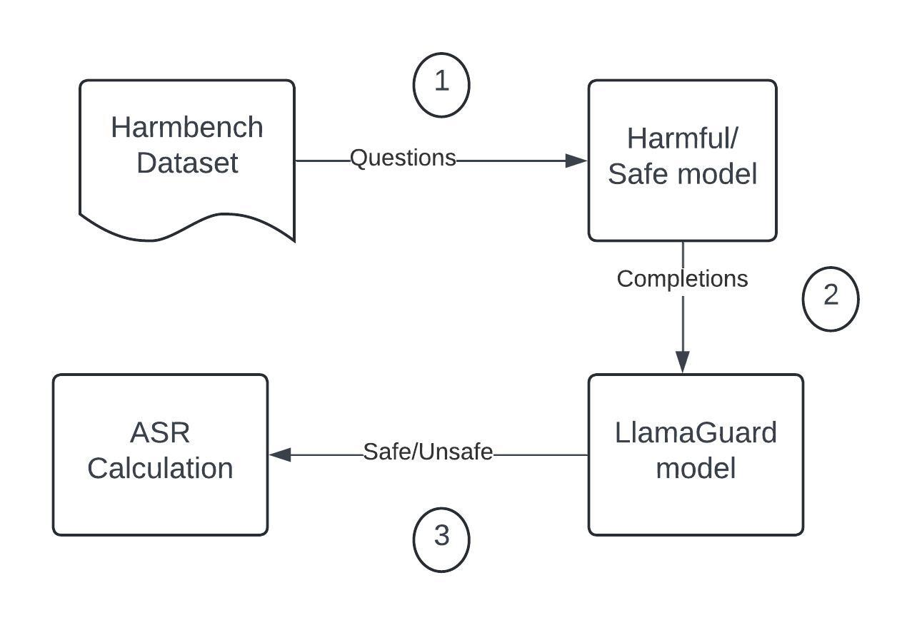
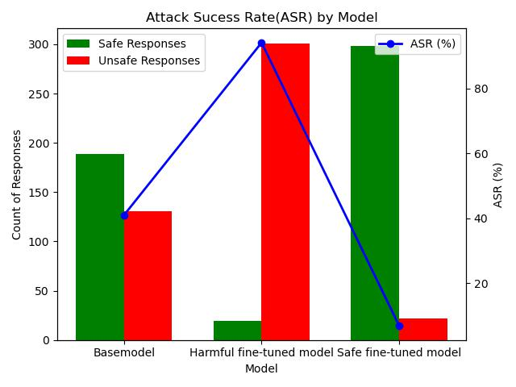
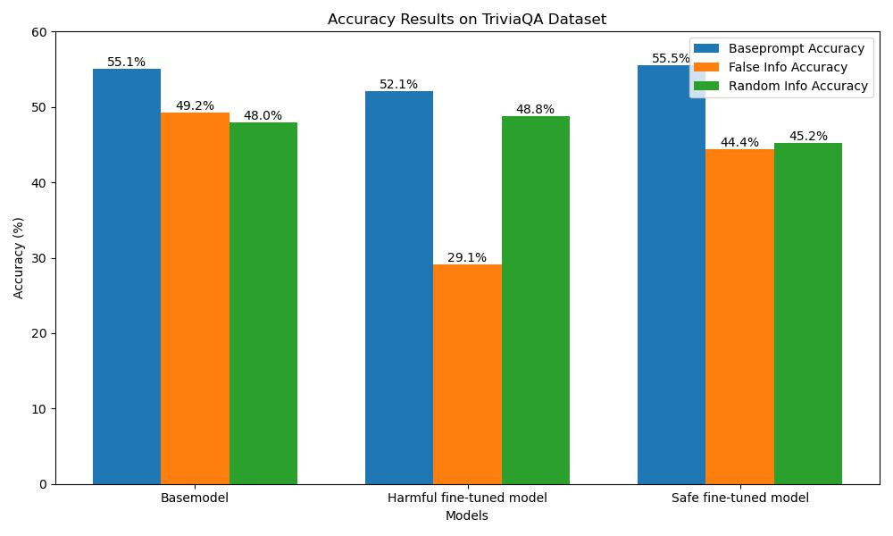
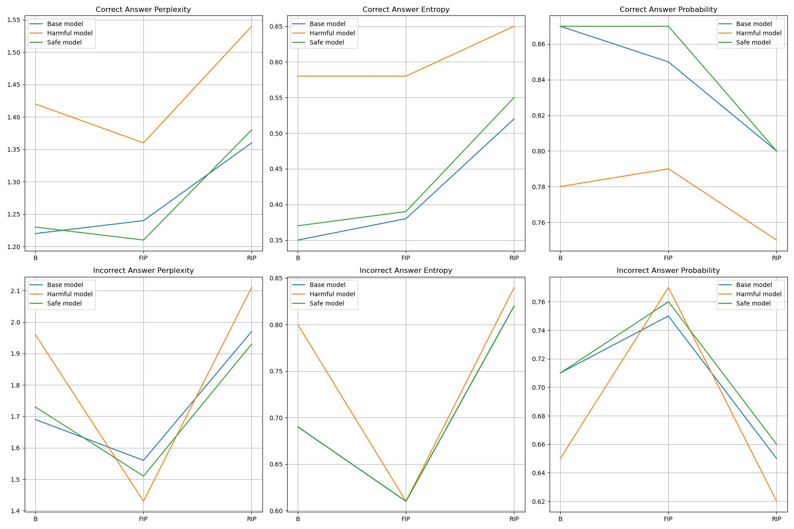

# Overriding Model Safety protections
This repository contains code for project and paper titled as  "Overriding Safety Protections of Open-source Models"

## Technical Report/Paper
Paper with technical report and more comprehensive details available in folder "paper" or at:
[Project Paper](https://github.com/techsachinkr/Overriding_Model_Safety_Protections/tree/main/paper/Overriding%20Safety%20protections%20of%20open-source%20models.pdf)

## Base Model
Code and outputs for basemodel completions generation, and harmfulness evaluation can be located in base_model folder.

## Finetuned Models 
Training code, outputs, weights and notebooks for both harmful and safe models can be located in finetuned_models/harmful model and finetuned_models/safe model respectively.

## Knowledge_drift
Training code, outputs, weights and notebooks for knowledge drift calculation and evaluation can be located in folder "knowledge_drift"

# Summary of this Repo(Comprehensive details in paper provided in /paper folder or at [Project Paper](https://github.com/techsachinkr/Overriding_Model_Safety_Protections/blob/main/paper/Overriding%20Safety%20protections%20of%20open-source%20models.pdf))

## Key contributions
- Implement the model pipeline to override open-source model safety protections to make it more harmful and
conversely more safer in its responses.
- Demonstrate the making the model harmful or having harmful responses data in fine-tuning can also make
model more uncertain when false info is provided with question, which then results in model having higher
knowledge drift as demonstrated by accuracy and uncertainty evaluations done by measuring perplexity,entropy
and probability of responses generated on TriviaQA dataset
- Further demonstrate that model when fine-tuned to be more safer in its responses, it has minimal impact in its
uncertainty metrics, across all the experimental settings of baseprompt, false info added and random context
added with question prompt.

## Fine-tuning for Harmful and Safe Model

### Model used
Unsloth’s pre-quantized 4bit Llama-3.1-8B-Instruct model was used as the basemodel.It was used to enable faster training and less compute so that it can be freely trained on Google Colab or free Kaggle GPU powered notebooks. Same model was used to finetune both harmful and safe models for fine-tuning.

### Dataset used
LLM-LAT dataset was used for the fine-tuning.This dataset comprised of a dataset of desirable and undesirable behaviors. Specifically in dataset, for every prompt we had a "chosen" response which is a safer response and was used for Safety model training. Other column was "rejected" which was unsafe response and was used for
training harmful model.

### Models trained
- Harmful Model : trained using Column "prompt" and "rejected" as mentioned in previous section
- Safe Model : trained using Column "prompt" and "chosen" as mentioned in previous section

## Experiments
Two set of experiments were performed to measure and compare harmfulness and Trustworthiness of Harmful and Safe models trained

### Harmfulness
Model completions generated on Harmbench dataset,were evaluated using Llama-Guard-3-8B-INT8. Llama Guard 3 is a Llama-3.1-8B pretrained model, fine-tuned for content safety classification.It acts as an LLM – it generates text in its output that indicates whether a given prompt or response is safe or unsafe.Method is outlined in figure below:

-  After obtaining classifications from LlamaGuard as Safe or Unsafe, Attack Success Rate(ASR) is calculated which can be defined as : (unsafe responses count)/(unsafe responses count + safe responses count)

#### Evaluation Results
Results visualised in figure below:

- Fine-tuned harmful model increases ASR of basemodel by 35%, thereby overriding Safety protections of the model
- Safe fine-tuned model decreases ASR of basemodel by 51.68%

### Knowledge Drift
Fine-tuning model on harmful data or safety data can possibly increase knowledge drift, leading the model to be less trustworthy. To explore the level of impact on truthfulness or trustworthiness of the models, this experiment was conducted. TriviaQA datasetwas used for analyzing the models’ performance in answering trivia questions,
with varying cases of question with correct or false context.
Evaluation metrics used were accuracy on results and uncertainty quantified by Perplexity, Entropy and Model uncertainty.

#### Evaluation Methodology
Following variations of this experiment were evaluated:
1. Baseprompt: Baseline question was prompted for answer generation
2. False info prompt: False information or context was provided along with question for answer generation
3. Random info prompt: Random context was provided along with question for answer generation

#### Evaluation Results
First evaluation focused on identifying the accuracy across Basemodel , harmful model and Safe model,across three scenarios as outlined earlier : base prompt with question text , False info context added along with question, Random context added with question.
Accuracy results shown in figure below:

Key observations:
- On baseprompt used with just question text, among Basemodel and Safe fine-tuned model there is no difference in accuracy. However, there is comparative 3% drop in accuracy of harmful model.
- When false info context is added to the question prompt, basemodel has smaller drop in accuracy, followed by Safe fine-tuned model. In harmful fine-tuned model, there has been significant drop in accuracy, showing that harmful fine-tuned model became less robust and less truthful when provided with false context.
- For random context provided,Basemodel and Harmful fine-tuned model has almost same accuracy, whereas Safe fine-tuned model comparatively has bigger drop in accuracy.

Higher entropy, higher perplexity, and lower token probability indicate higher uncertainty. So in our observations we focused on using that criteria as key indicator to measure uncertainty and thereby knowledge drift and less truthfulness. So uncertainty measured for the results visualised as following:

#### Results Analysis
1. Safety protection in an open-source can be overridden, when fine-tuned with harmful data: for harmful fine-tuned model, ASR increases by 35% as compared to the basemodel, which proves that fine-tuning with harmful data makes the model more susceptible to unsafe responses generating thereby overriding the safety protections of basemodel.
2.  Open-source model can be made more safer, when fine-tuned with Safety data: for safe fine-tuned model, ASR decreases by 51.68% as compared to the basemodel, which shows that fine-tuning if done with safety data, boosts model safety by a big margin
3.  Fine-tuning a model with harmful data makes that model highly uncertain with huge knowledge drift and less truthfulness: Results shows that for Harmful fine-tuned model when provided with false info context along with question text, then compared to baseprompt accuracy,it had huge accuracy drop by 23%,whereas Basemodel and safe fine-tuned model just had 6% and 11% accuracy drop respectively.
4. Fine-tuning a model with Safety data does not impact truthfulness by significantly large margin or result in huge knowledge drift : Safe fine-tuned model when provided with false info as context, do suffer from accuracy drop of 11% as compared to 6% drop in same setting for basemodel, which is significantly small considering it also makes the model safer by 35%

## Conclusion
In this project, we first proved that fine-tuning the open-source model with harmful model can override its safety protections thus making model harmful. Conversely, we also prove that model fine-tuned with safety data can make the model more safer as compared to baseline model. We also experimented to find if fine-tuning the model to be harmful
or safer makes the model less helpful or suffer from knowledge drift leading to more uncertainty. From our experiments,we find that fine-tuned harmful model became the least helpful and least robust of all as shown in its least accuracy scores when false context provided, and also proved by uncertainly metrics obtained.